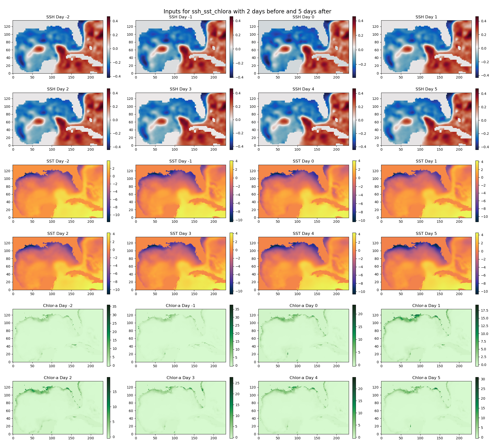

# Eddy Coherence ML

Machine learning framework for identifying and predicting Lagrangian coherent eddies in the Gulf of Mexico using satellite observations. This repository provides access to trained models described in our paper that predict Loop Current Eddies (LCEs) and Loop Current Frontal Eddies (LCFEs).

## Overview

This work demonstrates how machine learning can *identify* and *predict* the lifetime of Lagrangian coherent eddies using multiple satellite observations:
- Absolute Dynamic Topography (ADT)
- Sea Surface Temperature (SST)
- Chlorophyll-a (Chl-a)

## Model Performance

Our models achieve significant accuracy in eddy identification and lifetime prediction:

### Loop Current Eddies (LCEs)
- 90% accuracy in identification
- 93% accuracy in lifetime prediction

### Loop Current Frontal Eddies (LCFEs)
- 71% accuracy in identification
- 61% accuracy in lifetime prediction

The integration of SST and Chl-a data improved predictions compared to using ADT alone, highlighting the value of incorporating Chl-a data into ocean models.

## Significance

Lagrangian coherent eddies play a crucial role in ocean dynamics by transporting:
- Heat and salt
- Oil (as demonstrated during the 2010 Deepwater Horizon spill)
- Marine larvae
- Sargassum

This research investigates eddy coherence at three different durations: 5, 10, and 20 days.

## Repository Contents

```
.
├── config.yml                 # Configuration file for model testing
├── test_models.py            # Main script for testing trained models
├── viz_utils.py              # Visualization utilities
├── models/
│   └── Models2D.py           # U-Net model architecture implementation
├── input_data/               # Directory containing test datasets
│   └── test_data_*.pkl       # Test data files
├── model_weights/            # Directory containing trained model weights
│   ├── EddyDetection_ALL_1993-2022_gaps_filled_submean_only_ssh/
│   └── EddyDetection_ALL_1998-2022_gaps_filled_submean_sst_chlora/
├── outputs/                  # Directory for saving visualizations
├── LICENSE                   # MIT License
└── README.md                # Project documentation
```

### Key Files
- `config.yml`: Configuration file for specifying model parameters
- `test_models.py`: Main testing script that loads models and generates predictions
- `viz_utils.py`: Functions for visualizing inputs and predictions
- `models/Models2D.py`: Implementation of the U-Net architecture used for eddy detection


# Eddy Detection Model Testing

This repository contains code for testing trained U-Net models that detect ocean eddies using various input data types.

## Project Structure

- `test_models.py`: Main script for loading and testing trained models
- `viz_utils.py`: Visualization utilities for model inputs and predictions
- `models/Models2D.py`: Implementation of the U-Net architecture
- `input_data/`: Directory containing test data
- `model_weights/`: Directory containing trained model weights

## Features

- Support for both SSH-only and multi-variable (SSH, SST, Chlorophyll) inputs
- Temporal window processing (previous and following days)
- Visualization of inputs, predictions, and ground truth
- GPU support for inference

## Input Data Format

The input data is pre-processed and normalized as explained in the paper.

The data is provided in pickle files with the following structure:
```python
[
    {
        'file': str,  # Original data filename
        'data': tuple(
            np.ndarray,  # Input data array (Channels, Lat, Lon)
            np.ndarray   # Target mask (1, Lat, Lon)
        )
    },
    # ... more samples
]
```

For 'ssh_sst_chlora' inputs, the channels are organized as:
- SSH: channels [0 to days_total-1]
- SST: channels [days_total to 2*days_total-1]
- Chlor-a: channels [2*days_total to 3*days_total-1]

where days_total = days_before + days_after + 1

## Usage

1. Configure the model parameters in `config.yml`:
   ```yaml
   model:
     inputs: 'ssh_sst_chlora'  # or 'only_ssh'
     days_before: 2            # Must be 2
     lcv_length: 5            # Can be 5, 10, or 20
     test_id: 0               # Example ID to test (0-9)
   ```

2. Ensure model weights are in the correct directory structure:

3. Run the testing script:
   ```bash
   python test_models.py
   ```

The script will:
1. Load the model configuration from `config.yml`
2. Load and visualize the input data
3. Load the trained model and make predictions
4. Save visualizations in the `outputs` folder:

### Example Outputs

#### Input Data Visualization

*Input data visualization showing SSH, SST, and Chlorophyll-a across the temporal window*

#### Prediction Results

*Left: SSH with ground truth eddy overlay (green). Right: SSH with model prediction overlay (red)*

The output files are saved with descriptive names including the configuration parameters:
- `inputs_{input_type}_DaysBefore_{XX}_DaysAfter_{YY}_DaysCoherent_{YY}.png`
- `prediction_{input_type}_DaysBefore_{XX}_DaysAfter_{YY}_DaysCoherent_{YY}.png`

where:
- `input_type`: Either 'ssh_sst_chlora' or 'only_ssh'
- `XX`: Number of days before (always 2)
- `YY`: Length of coherent structure (5, 10, or 20)

## Citation

If you use this code in your research, please cite:

Hiron, L., Zavala-Romero, O., Chassignet, E. P., Miron, P., & Subrahmanyam, B. (2024). *Identifying and predicting the Lagrangian coherence of eddies in the Gulf of Mexico using machine learning and satellite observations*. Journal of Geophysical Research: Machine Learning and Computation. [Under Review]

## License

This project is licensed under the MIT License - see the [LICENSE](LICENSE) file for details.

## Contact

- **Luna Hiron**  
  Assistant Scientist  
  Center for Ocean-Atmospheric Prediction Studies  
  Florida State University  
  [Personal Website](https://lunahiron.github.io/)

- **Olmo Zavala Romero**  
  Assistant Professor  
  Department of Scientific Computing  
  Florida State University  
  [Faculty Profile](https://www.sc.fsu.edu/people?uid=osz09)